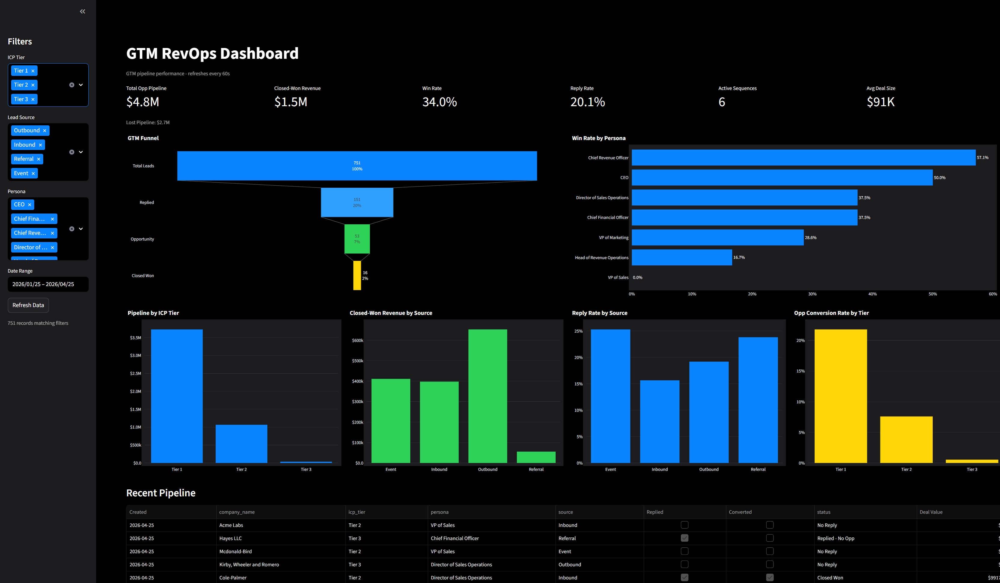

# GTM RevOps Pipeline Dashboard

## Overview
This project is a local GTM Revenue Operations dashboard that ties lead generation activity to opportunity creation, win/loss outcomes, and revenue realization. It includes synthetic data generation, ETL/metric logic, a FastAPI ingestion path, and a Streamlit dashboard.

## Business Problem
GTM teams often struggle to identify which combinations of ICP tier, persona, and source produce closed-won revenue. This dashboard makes those patterns visible so teams can prioritize high-converting segments.

## Dashboard Preview

## Architecture
The solution has four layers: data generation (`db/seed.py`), transformation/metrics (`core/`), ingestion API (`ingestion/api.py` and `ingestion/live_append.py`), and UI (`app.py`). SQLite (`revops_pipeline.db`) is the single local datastore.

## Data Model
- `leads`: account/profile attributes and ownership context.
- `sequences`: engagement, opportunity conversion, status, and deal values.
- Relationship: `sequences.lead_id` -> `leads.lead_id` (1:1 generated baseline).

## Metrics Reference
- `Total Leads` = count distinct `lead_id`.
- `Total Replies` = sum `replied`.
- `Reply Rate` = `Total Replies / Total Leads`.
- `Total Opps` = sum `converted_to_opp`.
- `Opp Rate` = `Total Opps / Total Leads`.
- `Closed Won Count` = count where `status = 'Closed Won'`.
- `Win Rate` = `Closed Won / (Closed Won + Closed Lost)`.
- `Total Opp Pipeline` = sum `deal_value` where `converted_to_opp = 1` (Open + Won + Lost).
- `Lost Pipeline` = sum `deal_value` where `status = 'Closed Lost'`.
- `Closed-Won Revenue` = sum `deal_value` where `status = 'Closed Won'`.
- `Active Sequences` = count where `status = 'Open'`.
- `Avg Deal Size` = average `deal_value` where converted and `deal_value > 0`.

## Tech Stack
- Python
- SQLite
- Faker
- Pandas
- Streamlit
- Plotly
- FastAPI
- Uvicorn
- Pydantic
- python-dotenv

## Getting Started
1. Create environment:
   - `python -m venv gtmvenv`
2. Install dependencies:
   - `gtmvenv\Scripts\python -m pip install -r requirements.txt`
3. Seed database:
   - `gtmvenv\Scripts\python db/seed.py`

## Running the Dashboard
- `gtmvenv\Scripts\python -m streamlit run app.py`

## Running the Live Ingestion
- API server:
  - `gtmvenv\Scripts\python -m uvicorn ingestion.api:app --port 8000`
- Manual append script:
  - `gtmvenv\Scripts\python ingestion/live_append.py --count 3`

## Future Improvements
- Replace mock generator with Salesforce, HubSpot, or Apollo API ingestion.
- Add dbt-style transformation layer for complex SQL models.
- Add cohort analysis by lead creation week.
- Add sales cycle duration metric (opportunity_created_at to closed_at).
- Add revenue forecasting from open pipeline with a simple close-rate multiplier.
- Deploy to Streamlit Community Cloud with a Postgres backend.
- Add token-based authentication to the ingest endpoint.
